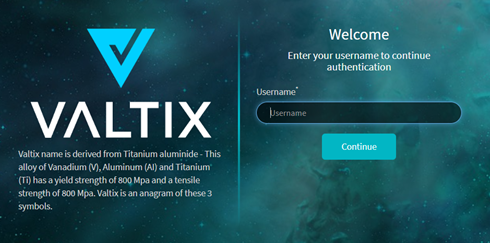
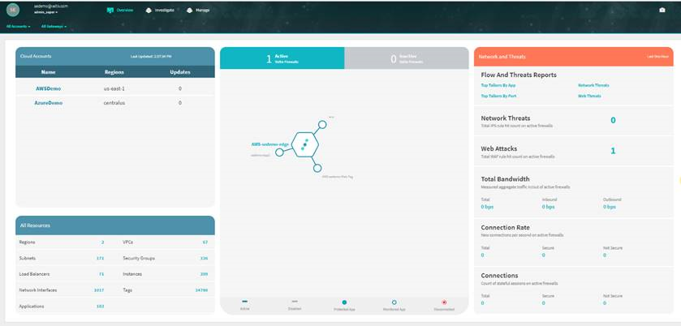

# Accessing the Valtix Dashboard
Valtix provides you with the link to the controller and credentials to access the controller.

To log into your account:

1. Click the link that Valtix provided you. 
The **Valtix Cloud Controller** login page displays.  
  
2. Enter your account username and password, and then click **Login**. 
The **Valtix Cloud Controller Dashboard** displays.  

